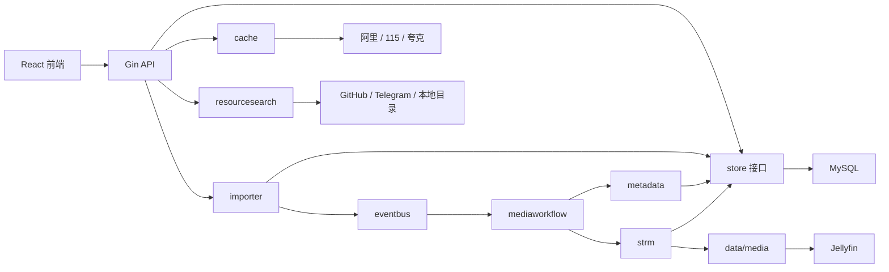

# 架构与模块边界

## 设计目标

ivideo 把“资源发现、分享导入、媒体识别、媒体发布、播放代理”拆成独立模块。业务模块通过小接口和领域事件协作，数据库、网盘实现或 Jellyfin 客户端都可以被替换，而不需要改动核心流程。

## 后端模块

| 包 | 职责 | 主要接口或入口 |
| --- | --- | --- |
| `internal/app` | 组合根，只在这里创建具体实现并连接模块 | `New`、`buildMediaModules` |
| `internal/router` | 按业务域集中注册路由 | `Register` |
| `internal/handlers` | HTTP 参数、响应和后台任务入口 | `Handler` |
| `internal/resourcesearch` | 可扩展资源发现引擎 | `Source`、`Engine` |
| `internal/importer` | 遍历分享并幂等写入资源 | `ShareSource`、`Catalog` |
| `internal/metadata` | 路径分析、候选匹配、内容复核和资料发布 | `PathAnalyzer`、`MatchEngine`、`ContentVerifier`、`MediaPublisher` |
| `internal/strm` | 规划并发布 Jellyfin 媒体目录 | `Repository`、`Generator` |
| `internal/mediaworkflow` | 用领域事件编排导入、刮削、发布和扫库 | `Publisher`、`Enricher`、`Library` |
| `internal/eventbus` | 进程内同步事件总线 | `Bus` |
| `internal/cache` | 按需转存、播放解析、清理和令牌诊断 | `CacheBackend` 及可选能力接口 |
| `internal/mediaproxy` | Range、HLS 和上游流代理 | `Stream` |
| `internal/jellyfin` | Jellyfin 初始化、媒体库和扫描 API | `Client` |
| `internal/store` | 持久化模型与仓储接口 | 七个细分 Repository |

## 接口边界

`store.Store` 只在组合根和需要多个数据域的 API 层使用。业务模块依赖更小的仓储接口：

- `ResourceRepository`：资源目录。
- `CacheRepository`：缓存状态机。
- `CredentialRepository`：网盘和第三方令牌。
- `SettingsRepository`：任务和系统设置。
- `MediaRepository`：识别、候选、作品组和发布记录。
- `JobRepository`：媒体处理任务与步骤。
- `ShareRepository`：分享源与健康状态。

新增业务模块时，应先定义自己的最小接口，再在 `internal/app/module_adapters.go` 中适配现有实现，不要直接依赖整个 `store.Store`。

## 领域事件

当前事件链为：

1. `media.resource.imported`：资源导入完成。
2. `media.metadata.verified`：元数据整理和复核完成。
3. `media.published`：STRM 媒体目录发布完成。

`mediaworkflow.Service` 订阅这些事件。导入模块不知道元数据或 Jellyfin 的具体实现，发布模块也不直接调用 Jellyfin。这使各阶段可以独立测试和替换。

## 扩展方式

### 新增资源发现来源

实现 `resourcesearch.Source`，在 `buildDiscovery` 注册。引擎会统一提供并发、超时、缓存、结果合并和健康状态。

### 新增网盘

实现 `cache.CacheBackend`；按需实现 `ShareLister`、`ShareWalker`、`ShareSaver`、`OriginalURLProvider`、`PlaybackProber` 等能力，然后在 `backends.New` 的 `Dispatcher` 中注册 provider。

### 新增元数据来源

实现 `metadata.MetadataProvider`，返回标准候选；候选仍需经过统一评分、动画类型约束和内容证据复核，不能绕过审核状态机直接写 NFO。
