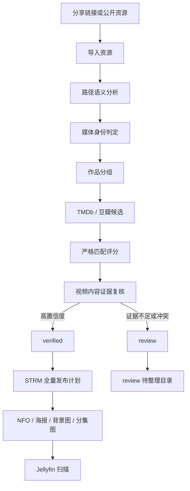

# 媒体识别与发布流程

## 总体流程



## 1. 路径语义分析

入口位于 `internal/strm/path_semantics.go` 和 `classify.go`。分析器使用资源标题与分享内完整路径，完成：

- 去除分辨率、编码、音轨、来源站、压制组等技术标记。
- 从父目录、文件名和合集目录生成多个标题候选。
- 识别电影年份、季号和集号。
- 判断电影、剧集、动漫、综艺或待整理。
- 保存分析版本和路径哈希，路径未变化时可复用结果。

完整路径只是证据之一，不能直接等同于作品名。纯数字分集、合集根目录、缩写和相似标题必须进入后续复核。

## 2. 媒体身份判定

`internal/mediaidentity` 在路径分析之后、作品分组之前合并相互独立的身份线索：

- 资源发布来源中的标题和分类。
- 分享内完整路径生成的片名候选。
- 文件名中的季号、集号及清晰度标记。
- 已确认别名与后续元数据、内容复核结果。

来源标题单独出现时只作为候选，不能自动发布。来源标题与路径一致，或来源标题与明确分集编号组合时，才可形成高置信度身份。例如 `师兄啊师兄` 的来源标题与 `146 4K.mp4` 可判定为第 146 集；合集标题与具名电影文件不一致时仍需逐项识别。

身份结论及证据保存到路径分析、标题候选、`media_verifications` 和任务步骤中。无法解释或证据冲突的资源进入 `review`，不会使用模糊搜索结果生成 NFO。

## 3. 作品分组与候选

语义相同的资源写入 `media_groups`，分集关系写入 `media_group_members`。同一作品的不同网盘来源可以属于同一媒体身份。

候选来源目前包括：

- TMDb：主要结构化元数据、图片和外部 ID。
- 豆瓣：中文标题、别名、年份和类型补充。
- 人工确认：优先级最高，写入稳定决定。

候选保存在 `media_candidates`，不会在搜索返回后立即覆盖媒体目录。

## 4. 严格匹配与内容复核

匹配器组合以下证据：

- 规范化标题和别名是否一致。
- 年份是否相符；年份冲突会显著降分或拒绝。
- 电影/剧集类型是否一致。
- 动画要求是否一致，防止动漫匹配到同名真人作品。
- 父目录、文件名和分集结构是否互相支持。
- 视频时长、分辨率、帧签名和 OCR 文本是否支持候选。

单一父目录或模糊相似标题不能自动通过。高置信度作品进入 `verified`；证据不足、候选冲突或内容不一致时进入 `review`，由设置中心的“媒体整理”页面确认。

## 5. STRM 发布计划

`internal/strm/planner.go` 会在写盘前规划全部资源，而不是边遍历边覆盖文件：

1. 按资源 ID 稳定排序。
2. 优先用 `元数据来源 + provider ID + 媒体库` 作为作品身份。
3. 同一作品、同一分集的重复来源只发布一个 STRM。
4. 不同作品同名时使用稳定作品组后缀隔离目录。
5. 内容不变时不写文件、不改变 mtime。
6. 只删除发布清单之外的孤儿 STRM，媒体库根目录永远保留。

因此连续两次全量发布应得到 `written=0`、`removed=0`，也不会无意义触发 Jellyfin 扫描。

## 6. 目录与文件

```text
movies/<片名> (<年份>)/<片名>.strm
movies/<片名> (<年份>)/<片名>.nfo

tv/<剧名>/tvshow.nfo
tv/<剧名>/Season 01/<剧名> S01E01.strm
tv/<剧名>/Season 01/<剧名> S01E01.nfo

anime/<动漫名>/...
variety/<综艺名>/...
review/resource-<ID> - <临时标题>/...
```

图片与 NFO 同目录发布，常见文件包括 `poster.jpg`、`fanart.jpg` 和分集同名缩略图。Jellyfin 自己的数据库和图片缓存位于 `data/jellyfin/config`、`data/jellyfin/cache`；后端生成的可迁移媒体资料位于 `data/media`。

## 7. NFO 原则

- 未完成匹配时只写带 `lockdata` 的最小兜底 NFO，阻止 Jellyfin 根据数字文件名随意联网猜测。
- 匹配确认后写入规范标题、年份、类型、外部 ID、简介和图片信息。
- 已有完整 NFO 不会被普通 STRM 重建覆盖。
- Jellyfin 扫描的是本地文件名和 NFO；STRM 内部的代理 URL 只负责播放，不参与作品名称匹配。

## 8. 人工修正

当结果错误时，不应直接修改 Jellyfin 海报作为最终方案。正确流程是：

1. 在设置中心打开“媒体整理”。
2. 查看原始路径、候选和证据。
3. 搜索正确候选并确认媒体库类型。
4. 重新运行元数据整理或等待事件自动发布。
5. 后端更新 NFO/图片并通知 Jellyfin 刷新。

人工确认会作为稳定决定保存，后续自动任务不得用低优先级候选覆盖。
